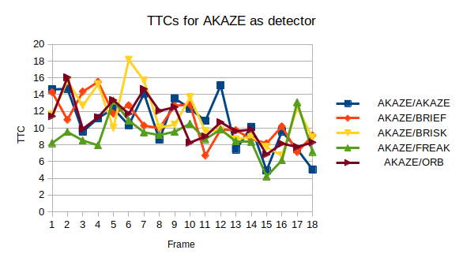
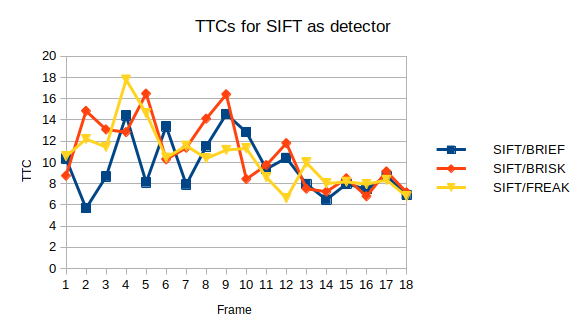

SFND 3D Object Tracking Project by Daniel Baudisch
==================================================

FP.1: Implement matchBoundingBoxes
----------------------------------

Function was implemented as suggested:
  * At the beginning the function creates a counter for each possible combination of "previous" boundingbox and "current"
    boundingbox.
  * For each match, the function takes the keypoint from the previous image and the keypoint from the current image. For
    the keypoint in the previous image, all boundingboxes for which the keypoint lies in are determined. Similar is done
    for the boundingboxes in the current image based on the keypoint in the current image. For each combination of the
    "previous" boundingboxes and the "current" boundingboxes the corresponding counter is incremented.
  * Finally, the mapping is created based on the counter array: for each "previous" boundingbox the function determines
    the "current" boundingbox with the most matches.

I also tried a different way: I assigned to each counter a value based on the overlap of two bounding boxes. Complexity
is O(#bounding boxes ^ 2) compared to the method above that has O(#matches * #bounding boxes).

Remark:
Something that I postponed way too long: update the visualization. During FP.3 and FP.4, I actually recognized that in a
single step that there are breaks just in the processing of one image. I did then a review and modifed the code in a way
that the processing of one image is done without a break. The drawing is done during the iteration os a single loop and
a "wait" is called only at the end. This showed that some steps were not executed due to some conditions. It helped a lot
in the debugging.

FP.2: TTC for Lidar
-------------------

The formula is straight forward and can be taken from previous lessons. However, to determine the right values for the
distance was quite a lot of experimenting with different statistical approaches (also to ensure that the computational
effort is kept low). In the end, a quite computing expensive operation is executed.

Tested approaches:
   * ***Select median:*** Sort points and select the median.
   * ***Compute average:*** Sort points, remove first and last _n_ points (assumption that there are a few outliners) and compute the average.
   * ***Compute average of closest points:*** Same as above, but use only closest _k_ points after removed the first _n_ points
   * ***Compute average until error falls under specified value:***
      1. Start with L = full list of point.
      1. Compute error for L ==> if lower then desired value, compute average of L.
      1. Compute error for L without first element.
      1. Compute error for L without last element.
      1. Remove the element causing the larger error.
      1. Go to step 2.

A more sophisticated algorithm should also consider the position in y direction. Example is already at hand: the car is
kind of "bend" and there is apparently one outliner in the middle, which seems to be okay-ish from its x-value.

FP.3 : Associate Keypoint Correspondences with Bounding Boxes
-------------------------------------------------------------

My first implementation seemed to have problems with outliers - especially with matches that have keypoints outside of the previous bounding box. Hence, the next step was to change the interface to also take the previous bounding box as argument into this function call.

Implementation:
   * Only consider the matches that have first keypoint in previous bounding box and second keypoint in current bounding box.
   * I had the filtering of matches based on Euclidean distance already implemented, but I did not see any changes on quality (after FP.4 was already implemented). So I commented the filtering out.

FP.4 : Compute Camera-based TTC
-------------------------------

I used the formula given in one of the previous lessons. The points is to determine h0 and h1 in the formula. To this end, h0 and h1 only need to be the distances between two matches (i.e. two pairs of tracked points). High-level idea is therefore:
   * Select a pair of matches (each match tracks a point)
   * Compute distance between points in previous frame (==> h0)
   * Compute distance between points in current frame (==> h1)
   * Compute TTC

Challenge was to select a good pair. Thereby, I considered following: Pairs of points that are close together will lead to a higher error. To get higher distances between a pair of tracked points, I sort the matches according to the Y value of the keypoints. I ran several tests and in many cases, that approach was already quite satisfying. However, some cases lead to quite high "noise". To improve in those cases, the algorithm uses several pairs, removes the ones that resulted in a NaN value and finally, I take the median out of the resulting list as result.

FP.5 : Performance Evaluation 1
-------------------------------

### Experiment

Used methods to compute the TTC:
   * ttcMethod = TTCMedian (sort list, take median)
   * ttcMethod = TTCAverage10 (sort list, remove first and last ten elements, compute average)
   * ttcMethod = TTCAverage10_First10 (sort list, remove first ten elements, compute average of next ten elements)
   * ttcMethod = TTCAverageSmallestError

A run with following commands:
$./3D_object_tracking

  ***Lidar:Median*** |      Lidar:Avg10 |  Lidar:Avg10Cl10 |  Lidar:AvgMinErr |    Camera:Median |     Camera:Avg10 | Camera:Avg10Cl10 | Camera:AvgMinErr
---------------------|------------------|------------------|------------------|------------------|------------------|------------------|-----------------
        12.515600    |        12.374812 |        13.806449 |        13.352985 |         1.256704 |         1.810627 |         0.071308 |         6.520647
        12.614245    |        13.216110 |        10.704909 |        12.152486 |        10.106185 |         8.006677 |         4.894691 |        10.106185
     ***14.091013*** |  ***17.165788*** |  ***14.970913*** |  ***18.911302*** |         4.384510 |         3.357245 |         3.197808 |         4.908068
     ***16.689386*** |        14.900194 |        10.226255 |        14.598984 |         5.870845 |         3.546933 |                - |         6.654123
        15.908233    |        12.743410 |        12.312320 |        12.497964 |                - |         1.730855 |                - |         3.615809
        12.678716    |        13.544171 |   ***6.701063*** |  ***14.802141*** |         3.019400 |         3.377528 |         2.957307 |         3.019400
        11.984351    |        13.291290    ***16.467190*** |        10.783008 |         2.920359 |         0.409687 |                - |        11.448349
     ***13.124118*** |        13.963203    ***18.078185*** |  ***15.423229*** |         1.562084 |         0.924601 |         0.050147 |         3.874026
        13.024118    |        12.580945 |        11.277533 |        12.970127 |         3.282068 |         2.981885 |         0.076886 |         6.799235
        11.174641    |        12.341949 |        13.731587 |        12.806308 |         2.466865 |         2.652301 |                - |         2.565320
        12.808601    |        11.957508 |         9.441069 |        11.510780 |         6.580250 |         4.222187 |         4.457521 |         7.977774
         8.959780    |        10.237946 |         9.400632 |        10.223198 |         3.372656 |         3.611966 |         3.517671 |         9.044844
      ***9.964390*** |         9.417084 |         8.273021 |         9.254543 |         4.990491 |         6.616758 |         3.112517 |        11.431390
         9.598630    |         9.427343 |  ***10.394741*** |         9.474407 |         1.555110 |         1.313830 |                - |                -
         8.573525    |         8.440677 |         7.634313 |         8.321200 |         7.074812 |        22.950574 |         4.965627 |         7.730384
         9.516170    |         9.023848 |         8.700758 |         8.898673 |         3.472479 |         3.098455 |         2.954516 |         3.472479
         9.546581    |  ***11.250549*** |         9.097104 |  ***11.030114*** |         7.079633 |         3.135788 |         6.615466 |         8.864827
         8.398803    |         8.412031 |         8.980818 |         8.535568 |         0.427746 |         1.223593 |         0.271523 |         6.492742

### Observation

The outliners for Lidar (Method to find distance: median of point cloud) are highlighted. The outlines clearly show an (unexpected) increase of the TTC: the
preceding vehicle gets constantly closer every cycle (can be seen by pure "eye" measurement), hence the TTC must get smaller every cycle. For the third
method (TTCAverage10_First10), there is also one outlier to the other direction (6seconds, while others are around 12 to 14 seconds) that might lead to a
false positive due to the strong drop, if it is not correctly handled in a fusion part afterwards.

### Reason / Explanation

Looking at the top-view visualization with the Lidar point cloud, one can see that especially the forth set has a lot of outlines to the far end. Just looking
at the points at the close end of the cloud should solve the problem (which is method Avg10Cl10). However, the values seem to be generally more distributed to
the far end of the bounding box. I expect that this can be generally observe in (more) real world data, and therefore, needs to be filtered properly.

### Final statement for TTC from Lidar

I would go for the TTCMedian or Avg10, since they seem to have pretty good values at O(nlog n) for the sorting and O(1) for determing the value.

FP.6 : Performance Evaluation 2
-------------------------------

### Experiment / Observation

Executed as described in assignment: run the benchmark (all images) for all combinations of detector and descriptor types. The table below shows the result of the runs for Lidar and the camera using the different detector and descriptor type. The last column contains the mean error compared to the Lidar measurements (only for valid measurements!).

Following combinations are not valid, and therefore, not listed:
   * BRISK/AKAZE
   * FAST/AKAZE
   * HARRIS/AKAZE
   * ORB/AKAZE
   * SHITOMASI/AKAZE
   * SIFT/AKAZE
   * SIFT/ORB

Entries without a value had not enough tracking points to compute the TTC.

  Method |    1-2|    2-3|    3-4|    4-5|    5-6|    6-7|    7-8|    8-9|   9-10|  10-11|  11-12|  12-13|  13-14|  14-15|  15-16|  16-17|  17-18|  18-19|  error
-----------------|-------|-------|-------|-------|-------|-------|-------|-------|-------|-------|-------|-------|-------|-------|-------|-------|-------|-------|------
           Lidar | 12.52 | 12.61 | 14.09 | 16.69 | 15.91 | 12.68 | 11.98 | 13.12 | 13.02 | 11.17 | 12.81 |  8.96 |  9.96 |  9.60 |  8.57 |  9.52 |  9.55 |  8.40 |     -
     AKAZE/AKAZE | 14.62 | 14.69 |  9.58 | 11.20 | 12.32 | 10.36 | 14.13 |  8.62 | 13.55 | 12.34 | 10.86 | 15.10 |  7.44 | 10.14 |  4.93 |  9.62 |  7.47 |  5.05 |  3.17
     AKAZE/BRIEF | 14.29 | 10.99 | 14.36 | 15.52 | 11.72 | 12.72 | 10.29 | 10.00 | 12.66 | 12.83 |  6.71 |  9.83 |  9.75 |  8.71 |  8.17 | 10.20 |  7.13 |  9.11 | ***2.19***
     AKAZE/BRISK | 11.59 | 15.63 | 12.68 | 15.24 | 10.00 | 18.15 | 15.66 | 10.07 | 10.41 | 13.66 |  9.64 |  9.73 |  8.65 |  8.97 |  7.74 |  6.70 | 12.44 |  8.86 |  2.84
     AKAZE/FREAK |  8.21 |  9.54 |  8.52 |  7.94 | 13.30 | 10.91 |  9.49 |  9.17 |  9.57 | 10.53 |  8.68 |  9.85 |  8.44 |  8.38 |  4.23 |  6.15 | 13.08 |  7.17 |  3.69
       AKAZE/ORB | 11.41 | 16.06 |  9.91 | 11.29 | 13.34 | 11.71 | 14.67 | 12.06 | 12.50 |  8.26 |  9.01 | 10.70 |  9.64 |  9.82 |  6.85 |  8.15 |  7.75 |  8.29 | ***2.47***
      AKAZE/SIFT |     - |     - |     - |     - |     - |     - |     - |     - |     - |     - |     - |     - |     - |     - |     - |     - |     - |     - |     -
     BRISK/BRIEF |  0.12 |  1.08 |  6.77 |  3.67 |  2.55 |  5.65 |  4.67 |  1.82 | 15.39 |  5.38 |  6.87 |  7.81 |  6.20 |  3.62 |  5.43 |  4.60 |  5.40 |  5.43 |  7.83
     BRISK/BRISK |  0.89 |  9.00 |  3.30 |  3.76 |     - |  3.92 | 10.17 |  4.94 | 10.84 |  4.51 |  5.47 |  4.58 |  3.78 |  5.70 |  6.71 | 11.44 |  5.11 |  6.64 |  7.78
     BRISK/FREAK |     - |  2.85 |  2.73 |  4.28 |  6.62 |  6.43 |  6.36 |  6.81 |  1.31 |  6.60 | 11.90 |  2.59 |  6.83 |  7.12 |  5.84 |  4.74 |  4.44 |  6.38 |  7.72
       BRISK/ORB |  1.95 |  4.41 |  5.23 |  4.80 |  2.41 |  3.32 |  6.22 |  3.18 | 11.74 |  4.45 |  5.01 |  4.32 |  7.42 |  1.86 |  3.58 |  5.80 |  4.17 |  3.93 |  7.76
      BRISK/SIFT |     - |     - |     - |     - |     - |     - |     - |     - |     - |     - |     - |     - |     - |     - |     - |     - |     - |     - |     -
      FAST/BRIEF |  1.26 | 10.11 |  4.38 |  5.87 |     - |  3.02 |  2.92 |  1.56 |  3.28 |  2.47 |  6.58 |  3.37 |  4.99 |  1.56 |  7.07 |  3.47 |  7.08 |  0.43 |  9.23
      FAST/BRISK |  5.37 |  5.39 |  8.48 |  5.27 |  3.87 |  5.55 | 10.01 |  7.44 | 26.61 |  6.14 |  8.69 |  6.80 |  5.98 |  6.06 |  6.92 |  9.83 |  7.98 |  7.25 |  6.51
      FAST/FREAK |  0.95 |     - |  2.37 |  1.49 |     - |  2.72 |     - |  5.73 |  4.46 |  4.30 |  7.04 |  6.72 |  9.77 | 11.11 |  4.61 |  3.64 |  5.69 |  5.14 | 10.70
        FAST/ORB |  8.41 |  3.45 |  3.86 |  3.89 |     - |  3.43 |  0.13 |  5.42 |  5.80 |  7.67 |  2.10 |  6.23 |  6.50 | 12.55 |  3.91 |  3.36 |  3.88 |  5.81 |  8.28
       FAST/SIFT |     - |     - |     - |     - |     - |     - |     - |     - |     - |     - |     - |     - |     - |     - |     - |     - |     - |     - |     -
    HARRIS/BRIEF |  2.42 |     - |268.90 |     - |  2.65 |     - |  5.74 |     - |     - |     - |     - |     - |  3.47 |     - |  9.53 |     - |     - |     - | 74.53
    HARRIS/BRISK |     - |     - |     - |     - |     - |     - |  6.72 |  3.93 |  0.19 |     - |  0.22 |     - |     - |     - |     - |  7.52 |  4.46 |     - | 14.20
    HARRIS/FREAK |  2.65 |     - | 11.37 |  0.20 |     - |     - |  6.42 |  0.57 |  0.10 |     - |  0.27 |  0.27 |     - |     - |     - |  2.36 |  4.46 | 31.57 | 12.51
      HARRIS/ORB |     - |     - |268.90 |     - |  3.43 |     - | 11.80 |  3.28 |     - |     - |     - |     - |     - |     - |  2.04 |     - |     - |     - | 85.74
     HARRIS/SIFT |     - |     - |     - |     - |     - |     - |     - |     - |     - |     - |     - |     - |     - |     - |     - |     - |     - |     - |     -
       ORB/BRIEF |     - |  3.41 |  5.90 |  5.47 |  3.42 |  6.33 |  5.84 | 12.36 |  4.73 | 10.39 | 41.15 |     - |     - |  9.52 |  4.00 | 10.73 |     - |     - | 16.41
       ORB/BRISK |  2.82 |  5.90 |  7.35 |  1.53 |     - |  2.38 |  5.94 |  9.46 |  1.77 |  0.18 |  1.75 |  3.61 |  3.78 |  4.30 |  2.20 |  3.90 |     - |  0.65 | 10.36
       ORB/FREAK |  7.94 |     - |  4.82 |  4.56 |     - |     - |     - |  6.74 |  1.06 |  3.03 |  7.25 |  9.74 |  4.76 |  2.33 |  4.70 |  2.73 |  0.92 |  3.08 | 10.53
         ORB/ORB | 12.24 |     - |  4.14 |  4.31 |  2.85 |  5.06 |  5.73 |  2.91 | 17.65 |  6.47 |  5.03 |  5.01 |  6.48 |  5.21 |  3.59 |  6.03 |  5.15 |  3.98 | 11.11
        ORB/SIFT |     - |     - |     - |     - |     - |     - |     - |     - |     - |     - |     - |     - |     - |     - |     - |     - |     - |     - |     -
 SHITOMASI/BRIEF |  2.89 |  6.90 |  9.46 |  3.88 |  1.73 |  4.13 |  2.67 |  5.07 |  7.86 |  1.29 |  5.20 |     - |  6.29 |  6.66 |  5.53 |  3.98 | 15.29 |  5.99 |  8.34
 SHITOMASI/BRISK |  8.45 |  6.35 |  6.57 |  7.41 | 10.09 |  5.88 |  2.65 |  7.77 |  7.04 |  9.40 |  3.50 |  7.79 |  9.74 |  9.42 |  6.44 |  6.96 |  6.55 |  9.26 |  5.49
 SHITOMASI/FREAK |  5.71 |  5.48 |  6.66 |  5.76 |  8.44 | 11.32 |  9.14 |  5.29 |  8.18 |  7.57 |  8.69 |  6.63 |  7.95 | 10.12 |  4.73 |  5.83 |  8.54 |  4.83 |  5.29
   SHITOMASI/ORB |  1.21 |  4.38 |  3.68 |     - |  4.45 |  4.48 |  6.15 |  6.51 |  7.12 | 12.42 |  6.16 |  9.83 |  5.26 |  6.29 |  5.81 |  5.43 |  6.20 |  4.83 |  7.65
  SHITOMASI/SIFT |     - |     - |     - |     - |     - |     - |     - |     - |     - |     - |     - |     - |     - |     - |     - |     - |     - |     - |     -
      SIFT/BRIEF | 10.35 |  5.68 |  8.66 | 14.42 |  8.11 | 13.39 |  7.91 | 11.52 | 14.55 | 12.85 |  9.38 | 10.42 |  7.96 |  6.49 |  7.98 |  7.47 |  8.73 |  6.93 |  3.40
      SIFT/BRISK |  8.74 | 14.85 | 13.10 | 12.85 | 16.48 | 10.29 | 11.38 | 14.12 | 16.41 |  8.43 |  9.75 | 11.81 |  7.52 |  7.24 |  8.50 |  6.81 |  9.15 |  7.18 | ***2.35***
      SIFT/FREAK | 10.58 | 12.20 | 11.45 | 17.79 | 14.63 | 10.44 | 11.57 | 10.38 | 11.17 | 11.32 |  8.60 |  6.62 |  9.98 |  8.01 |  8.17 |  7.95 |  8.34 |  6.80 | ***1.86***
       SIFT/SIFT |     - |     - |     - |     - |     - |     - |     - |     - |     - |     - |     - |     - |     - |     - |     - |     - |     - |     - |     -

Looking at the table, it can be seen that some combinations provide a valid TTC in 100 percent of the given data set, which is a prefered base to use them at all. In my opinion, a combination is okay to have no valid TTC up to a certain amount (e.g. 1 in 1000 cases) if they would provide good results, i.e. a TTC close to ground-truth. Other combinations are literally useless for the data set at hand: they don't provide values at all (HARRIS/\*, \*/SIFT).

Walking through the table, I would select an approach that has 1) good coverage (valid TTC in most cases) and 2) that is close to Lidar TTC, which I consider as a trustful source to judge wether a TTC from camera is close to the ground truth data. In previous task (FP.5), I already highlighted the values for the Lidar TTCs that need to be ignored for this comparison.

To select a combination for further use, I computed the mean error to the Lidar TTC. BRISK/\*, FAST/\*, HARRIS/\*, ORB/\* and SHITOMASI/\* are all above an error of 5. In contrast, AKAZE and SIFT seem to be suited detectors for the given data set. In particular, SIFT/FREAK and AKAZE/BRIEF provide the lowest error (which also includes the comparison to the outliers in the Lidar TTCs). Nevertheless, definitely worth to follow those combination for further development. As a next step, I would also have a look at the performance of those detectors.

